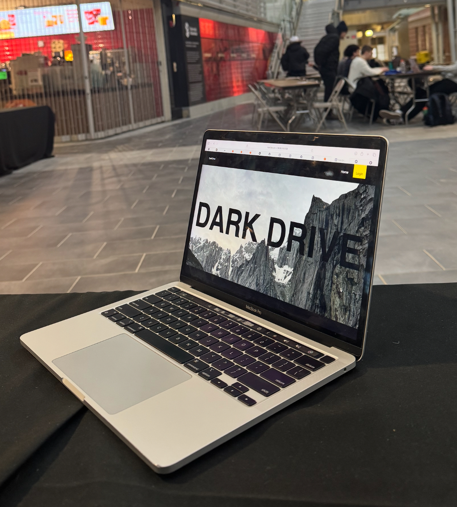

# 🚀 DarkDrive - The Future of Secure File Sharing

DarkDrive is not just another file-sharing platform—it's a fortress for your data. Designed to be **ultra-secure, highly resilient, and completely private**, DarkDrive ensures that your files remain accessible to **you and only you**. 

With multiple virtual machines working behind the scenes, DarkDrive is **virtually untouchable**, making takedowns nearly impossible. Plus, thanks to **end-to-end encryption**, even we have no clue what's inside your files. Your data, your control. 🔒

## 🌟 Tech Stack
- **Frontend:** React ⚛️
- **Backend:** Flask 🐍, FastAPI ⚡
- **Database:** SQLite 🗄️
- **Hosting:** AWS EC2 ☁️

## 🔥 Features
- **💾 Secure File Storage:** Your files are **encrypted** and split across multiple machines for **maximum security**.
- **🛡️ End-to-End Encryption:** Only **you** hold the key to unlock your files.
- **🔑 Authentication:** No passwords, no headaches. Just verify via an **email link**.
- **🎨 Beautiful UI:** Smooth, polished, and **super intuitive**.
- **💪 Resilient Architecture:** Hosted on multiple virtual machines—**always up, never down**.

## 🚀 How It Works
1. **Go to DarkDrive** - No installation needed, just visit the website.
2. **Login with Email** - A confirmation link is sent for quick, secure access.
3. **Upload Your Files** - Store them securely with **automatic encryption**.
4. **Receive a Token & Key** - Your unique credentials to retrieve files later.
5. **Download Anytime** - Use your token and key to get your files—no one else can.

## 💡 Contributors
DarkDrive is built by an elite team of innovators:
- **Ali Nawaz** 🧠
- **Sheikh Muhammad Hashir** 🔥
- **Rayan Kashif** ⚡
- **Hayyan Haider** 🚀

## ⚖️ License
This project is **proprietary** and not open-source. The DarkDrive team holds all rights.
